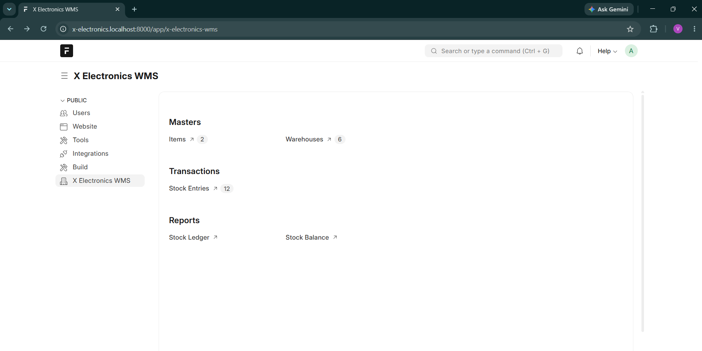
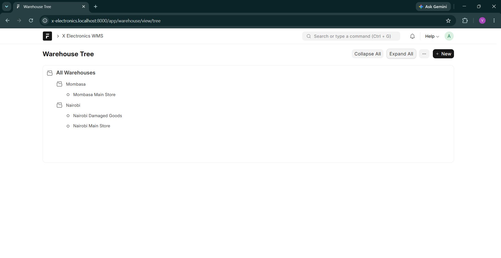
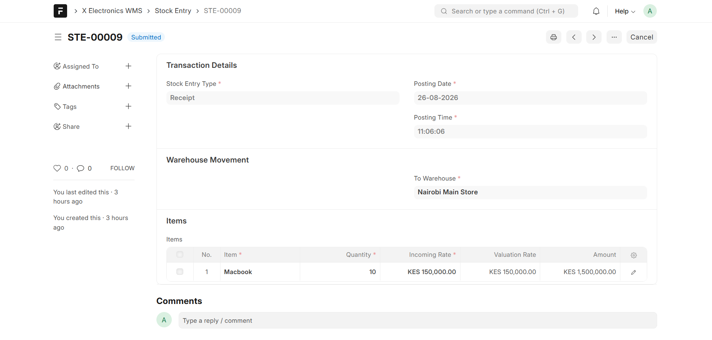
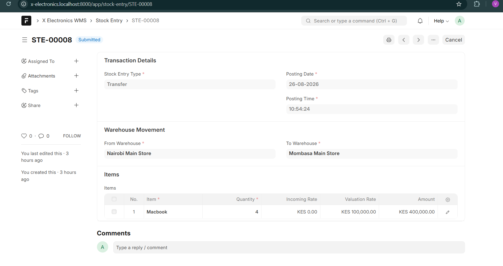
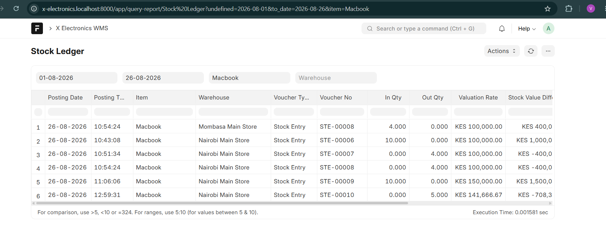
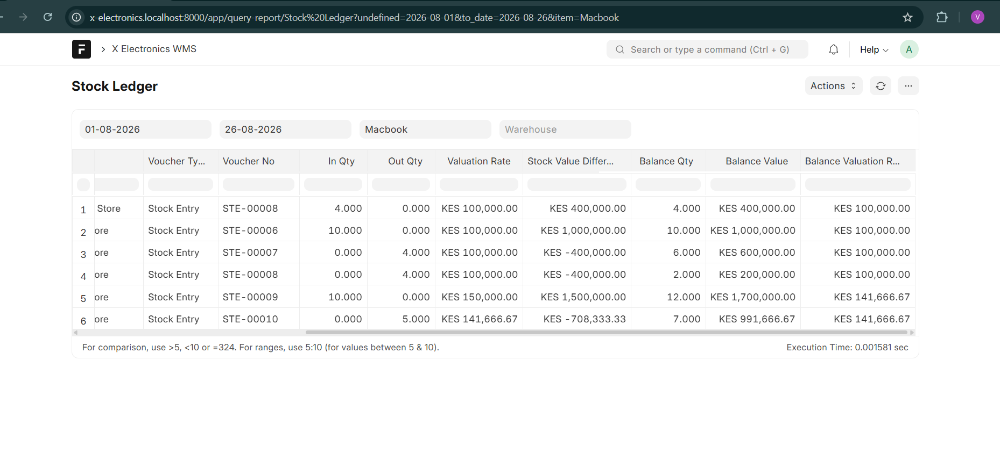
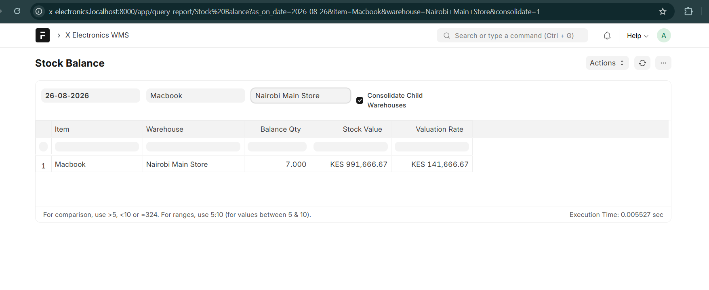
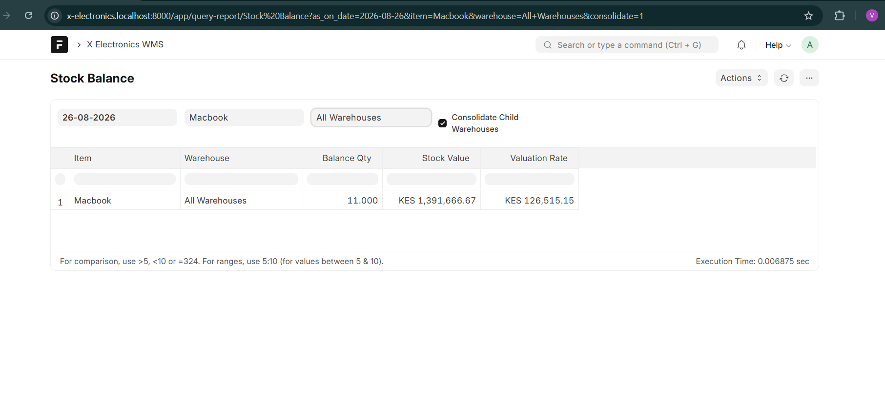

# X Electronics Warehouse Management System

A Warehouse Management System built with the **Frappe Framework** for X Electronics.

The application implements core inventory operations using a stateless stock ledger, moving-average valuation, hierarchical warehouses, stock transactions, reporting, and automated tests.

The project was developed as a technical exercise to demonstrate Frappe fundamentals, business-rule implementation, inventory accounting logic, report development, and automated testing.

---

## Features

The system provides:

- Item master management
- Hierarchical warehouse management using a Frappe Tree DocType
- Stock Receipts
- Stock Consumption
- Stock Transfers between warehouses
- Stateless Stock Ledger Entries
- Moving-average inventory valuation
- Stock Ledger report with running balances
- Stock Balance report
- Warehouse hierarchy consolidation
- Transaction cancellation safeguards
- Automated transaction and report tests

---

## Technology

Developed and tested using:

- Frappe Framework v15
- Python 3.12
- MariaDB
- Redis
- Node.js 20
- Frappe Bench

Development was performed on Ubuntu under WSL2.

---

# System Design

The inventory model is based around four main concepts:

1. **Item**
2. **Warehouse**
3. **Stock Entry**
4. **Stock Ledger Entry**

Stock quantities are not stored as mutable balance fields.

Instead, every stock movement creates one or more **Stock Ledger Entries**, and the current stock position is calculated from the ledger.

This keeps the ledger stateless and makes every inventory movement traceable to its originating transaction.

---

# Data Model

## Item

The Item DocType represents products that can be stored and moved through the warehouse system.

Important fields include:

| Field | Purpose |
|---|---|
| Item Code | Unique identifier for an item |
| Item Name | Human-readable item name |
| Description | Optional item description |
| Stock UOM | Unit of measure |
| Disabled | Prevents the item from being used in new stock transactions |

The Item Code is used as the document name.

Disabled items cannot participate in new stock transactions.

---

## Warehouse

Warehouse is implemented as a **Tree DocType**.

This allows warehouses to be organized hierarchically.

Example:

```text
All Warehouses
├── Nairobi
│   ├── Nairobi Main Store
│   └── Nairobi Damaged Goods
│
└── Mombasa
    └── Mombasa Main Store
```

Warehouses can either be:

- **Group warehouses** – used for organization and consolidation
- **Leaf warehouses** – physical stock locations

Stock transactions are only allowed against leaf warehouses.

Group warehouses cannot directly contain stock.

---

## Stock Entry

Stock Entry represents an inventory transaction.

Supported transaction types are:

- Receipt
- Consume
- Transfer

Each Stock Entry contains one or more Stock Entry Item rows.

Important fields include:

| Field | Purpose |
|---|---|
| Stock Entry Type | Receipt, Consume, or Transfer |
| Posting Date | Transaction date |
| Posting Time | Transaction time |
| From Warehouse | Source warehouse |
| To Warehouse | Destination warehouse |
| Items | Items and quantities involved |
| Remarks | Optional transaction notes |

Stock Entry is a **submittable DocType**.

Inventory movement occurs when the document is submitted.

---

## Stock Entry Item

Stock Entry Item is a child table used by Stock Entry.

Each row contains:

- Item
- Quantity
- Incoming Rate
- Valuation Rate
- Amount

For Receipt transactions, the incoming rate is supplied by the user.

For Consume and Transfer transactions, valuation is calculated automatically using the current moving-average valuation rate.

---

# Transaction Rules

## Receipt

A Receipt adds inventory to a warehouse.

Requirements:

- To Warehouse is required
- From Warehouse must be empty
- Destination must be an enabled leaf warehouse
- Quantity must be greater than zero
- Incoming Rate must be greater than zero

Example:

```text
Receipt

Item: Laptop
Warehouse: Nairobi Main Store
Quantity: 10
Rate: 100

Ledger movement:

Quantity: +10
Stock Value Difference: +1000
```

---

## Consume

A Consume transaction removes inventory from a warehouse.

Requirements:

- From Warehouse is required
- To Warehouse must be empty
- Source must be an enabled leaf warehouse
- Quantity must be greater than zero
- Sufficient stock must exist

The inventory is consumed using the current moving-average valuation rate.

Example:

```text
Existing Stock:
10 units
Stock Value = 1000
Average Rate = 100

Consume:
4 units

Ledger movement:

Quantity: -4
Stock Value Difference: -400

Remaining:

Quantity = 6
Stock Value = 600
Average Rate = 100
```

---

## Transfer

A Transfer moves stock between two warehouses.

Requirements:

- From Warehouse is required
- To Warehouse is required
- Source and destination must be different
- Both warehouses must be enabled leaf warehouses
- Sufficient stock must exist at the source

A transfer creates **two Stock Ledger Entries**:

```text
Source Warehouse
Quantity: -Q
Value: -V

Destination Warehouse
Quantity: +Q
Value: +V
```

The valuation rate is taken from the source warehouse.

Therefore, a transfer changes the stock location but does not change the total inventory quantity or total inventory value.

---

# Stock Ledger Entry

Stock Ledger Entry records individual inventory movements.

Important fields include:

| Field | Purpose |
|---|---|
| Posting Date | Date of movement |
| Posting Time | Time of movement |
| Item | Item being moved |
| Warehouse | Warehouse affected |
| Actual Qty | Signed quantity movement |
| Valuation Rate | Valuation rate used |
| Stock Value Difference | Signed inventory value movement |
| Voucher Type | Originating transaction type |
| Voucher No | Originating document |
| Is Cancelled | Indicates whether the movement has been cancelled |

Examples of signed quantities:

```text
Receipt       +10
Consume        -4
Transfer Out   -2
Transfer In    +2
```

The Stock Ledger Entry intentionally does **not** store fields such as:

```text
quantity_after_transaction
stock_value_after_transaction
```

Balances are calculated from the ledger instead.

---

# Stateless Inventory Ledger

The system uses a stateless ledger approach.

Current quantity is calculated as:

```text
Quantity = SUM(actual_qty)
```

Current stock value is calculated as:

```text
Stock Value = SUM(stock_value_difference)
```

Only active ledger entries are included:

```text
is_cancelled = 0
```

The current valuation rate is then calculated as:

```text
Valuation Rate = Stock Value / Quantity
```

when quantity is greater than zero.

This logic is implemented in:

```text
x_electronics_wms/x_electronics_wms/utils/stock.py
```

---

# Moving-Average Valuation

The project implements basic moving-average valuation.

Suppose the following transactions occur.

### First Receipt

```text
10 units @ 100

Quantity = 10
Stock Value = 1000
Average Rate = 100
```

### Consume 4 Units

```text
4 units @ current average rate of 100

Quantity = 6
Stock Value = 600
Average Rate = 100
```

### Second Receipt

```text
6 units @ 200

Additional Value = 1200
```

New position:

```text
Quantity = 12
Stock Value = 1800

Moving Average Rate:

1800 / 12 = 150
```

Therefore:

```text
New Valuation Rate = 150
```

Future Consume and Transfer transactions use this updated valuation rate.

---

# Validation

Stock Entry performs business-rule validation before submission.

Examples include:

- Invalid transaction type rejected
- Receipt requires a destination warehouse
- Consume requires a source warehouse
- Transfer requires both warehouses
- Transfer cannot use the same source and destination
- Group warehouses cannot hold stock
- Disabled items cannot be transacted
- Duplicate items in one transaction are rejected
- Quantity must be greater than zero
- Receipt incoming rate must be greater than zero
- Consume cannot exceed available stock
- Transfer cannot exceed available stock

Validation is performed before ledger entries are created.

This prevents invalid transactions from changing inventory.

---

# Cancellation

Submitted Stock Entries can be cancelled.

Ledger entries are preserved for auditability rather than deleted.

Cancellation marks the associated Stock Ledger Entries as:

```text
is_cancelled = 1
```

Cancelled movements are ignored when calculating inventory balances and reports.

For example:

```text
Transfer:

Nairobi  -> -2
Mombasa  -> +2
```

After cancellation, both ledger entries remain in the database but are excluded from active inventory calculations.

---

## Cancellation Safeguard

The project intentionally prevents cancelling an older stock transaction when later active stock movements depend on it.

For example:

```text
Receipt
   ↓
Consume
   ↓
Transfer
```

Cancelling the original Receipt would require recalculating the valuation of the later Consume and Transfer transactions.

A full production inventory system would normally implement a **reposting engine** to recalculate downstream stock valuation.

This exercise does not implement a reposting engine.

Therefore, older transactions with dependent later movements are blocked from cancellation to prevent inconsistent stock valuation.

The most recent eligible transaction can still be cancelled safely.

---

# Reports

The application contains two Script Reports:

1. Stock Ledger
2. Stock Balance

---

## Stock Ledger Report

The Stock Ledger report shows individual stock movements together with running inventory balances.

Filters include:

- From Date
- To Date
- Item
- Warehouse

Columns include:

- Posting Date
- Posting Time
- Item
- Warehouse
- Voucher Type
- Voucher No
- In Qty
- Out Qty
- Valuation Rate
- Stock Value Difference
- Balance Qty
- Balance Value
- Balance Valuation Rate

Running balances are calculated independently for each:

```text
(Item, Warehouse)
```

### Opening Balance Behaviour

When a From Date is supplied, transactions before the From Date are still processed internally.

They contribute to the opening balance but are not displayed in the final report.

For example:

```text
Jan 01  Receipt +10
Jan 05  Consume -2
Jan 10  Transfer -3
```

If the report starts from Jan 10, the Jan 01 and Jan 05 transactions are not displayed, but their resulting balance is used as the opening position for Jan 10.

This prevents the running balance from incorrectly starting at zero.

---

## Stock Balance Report

The Stock Balance report shows inventory balances as of a selected date.

Filters include:

- As On Date
- Item
- Warehouse
- Consolidate Child Warehouses

Output includes:

- Item
- Warehouse
- Balance Qty
- Stock Value
- Valuation Rate

Balances are calculated from active Stock Ledger Entries up to the selected date.

---

# Warehouse Consolidation

The Stock Balance report supports warehouse-tree consolidation.

Suppose the structure is:

```text
All Warehouses
├── Nairobi
│   ├── Nairobi Main Store
│   └── Nairobi Damaged Goods
│
└── Mombasa
    └── Mombasa Main Store
```

Selecting:

```text
Warehouse: Nairobi
Consolidate Child Warehouses: Yes
```

returns the combined stock held in Nairobi's leaf warehouses.

Selecting:

```text
Warehouse: All Warehouses
Consolidate Child Warehouses: Yes
```

returns consolidated inventory across the entire warehouse hierarchy.

Group warehouses therefore function as logical reporting nodes without directly containing stock.

---

# Automated Tests

The application contains automated tests covering stock transactions and reports.

The current test suite contains **17 tests**:

```text
Stock Entry       11 tests
Stock Ledger       3 tests
Stock Balance      3 tests
---------------------------
Total             17 tests
```

---

## Stock Entry Tests

Transaction tests cover:

1. Receipt creates stock
2. Consume uses moving-average valuation
3. Insufficient stock is rejected
4. Transfer creates two ledger movements
5. Transfer preserves total inventory
6. Cancelling a transfer restores stock
7. Older transactions with later movements cannot be cancelled
8. Group warehouses reject stock
9. Transfer rejects identical source and destination warehouses
10. Zero quantity is rejected
11. Disabled items are rejected

Tests also verify that failed transactions do not accidentally modify inventory.

Run with:

```bash
bench --site test_x_electronic.localhost run-tests --doctype "Stock Entry"
```

---

## Stock Ledger Report Tests

The Stock Ledger report tests verify:

- Running balances through Receipt, Consume, and Transfer
- Cancelled ledger entries are excluded
- From Date filtering preserves the correct opening balance

Run with:

```bash
bench --site test_x_electronic.localhost run-tests \
  --module "x_electronics_wms.x_electronics_wms.report.stock_ledger.test_stock_ledger"
```

---

## Stock Balance Report Tests

The Stock Balance report tests verify:

- Individual warehouse balances
- Historical balance using As On Date
- Parent warehouse consolidation

Run with:

```bash
bench --site test_x_electronic.localhost run-tests \
  --module "x_electronics_wms.x_electronics_wms.report.stock_balance.test_stock_balance"
```

---

# Project Structure

Important application files are organized approximately as follows:

```text
x_electronics_wms/
│
├── x_electronics_wms/
│   │
│   ├── doctype/
│   │   │
│   │   ├── item/
│   │   │
│   │   ├── warehouse/
│   │   │
│   │   ├── stock_entry/
│   │   │
│   │   ├── stock_entry_item/
│   │   │
│   │   └── stock_ledger_entry/
│   │
│   ├── report/
│   │   │
│   │   ├── stock_ledger/
│   │   │   ├── stock_ledger.js
│   │   │   ├── stock_ledger.py
│   │   │   └── test_stock_ledger.py
│   │   │
│   │   └── stock_balance/
│   │       ├── stock_balance.js
│   │       ├── stock_balance.py
│   │       └── test_stock_balance.py
│   │
│   └── utils/
│       └── stock.py
│
├── license.txt
├── pyproject.toml
└── README.md
```

---

# Installation

## Prerequisites

A working Frappe v15 Bench environment is required.

Example environment:

```text
Frappe Framework 15
Python 3.12
Node.js 20
MariaDB
Redis
Yarn
Bench CLI
```

---

## Clone the Application

From your Frappe bench directory:

```bash
bench get-app https://github.com/17shoni/x_electronics_wms.git
```

Alternatively:

```bash
cd apps
git clone https://github.com/17shoni/x_electronics_wms.git
cd ..
```

---

## Install on a Site

```bash
bench --site your-site.localhost install-app x_electronics_wms
```

Then migrate the site:

```bash
bench --site your-site.localhost migrate
```

Build application assets:

```bash
bench build --app x_electronics_wms
```

Clear cache:

```bash
bench --site your-site.localhost clear-cache
```

Start the development server:

```bash
bench start
```

The application can then be accessed through the Frappe Desk.

---

# Test Site Setup

Tests should preferably be executed against a dedicated test site rather than development data.

Example:

```bash
bench new-site test_x_electronic.localhost
```

Install the application:

```bash
bench --site test_x_electronic.localhost install-app x_electronics_wms
```

Enable tests:

```bash
bench --site test_x_electronic.localhost set-config allow_tests true
```

Then run the required test suites.

---

# Assumptions and Limitations

This project intentionally focuses on the core requirements of the warehouse-management exercise.

Current limitations include:

### No Reposting Engine

Backdated changes and cancellation of older dependent transactions would require recalculation of later valuation.

A production implementation should include a chronological stock reposting engine.

For safety, the current implementation blocks cancellation where later stock movements depend on the transaction.

### Basic Moving-Average Valuation

The application implements moving-average valuation only.

Other valuation methods such as FIFO are outside the current scope.

### Leaf Warehouses Hold Stock

Group warehouses are used strictly for organization and reporting consolidation.

Stock can only be posted to leaf warehouses.

### Inventory Derived from Ledger

No independent stock balance table is maintained.

Balances are derived from active Stock Ledger Entries.

This keeps the implementation simple and auditable for the scope of the exercise.

### Chronological Valuation

The current valuation logic is designed around chronologically submitted stock transactions.

A production system supporting arbitrary backdated inventory transactions would require downstream reposting and valuation recalculation.

---

# Possible Future Improvements

Potential production enhancements include:

- Stock reposting for backdated transactions
- FIFO valuation
- Batch and serial number tracking
- Multiple units of measure
- Stock reservation
- Reorder levels
- Purchase and sales integration
- Inventory adjustments
- Warehouse permissions
- Stock reconciliation
- Audit dashboards
- Additional inventory analytics
- Background processing for large ledgers

---

# Screenshots

## Application Workspace

The X Electronics WMS workspace provides direct access to master data,
stock transactions, and inventory reports.



---

## Warehouse Hierarchy

Warehouses are implemented using a Frappe Tree DocType. Group warehouses
organize the hierarchy while leaf warehouses hold physical stock.



---

## Stock Receipt

Receipts increase inventory at the destination warehouse. The user supplies
the Incoming Rate, while Valuation Rate and Amount are system controlled.



---

## Stock Transfer

Transfers move inventory between warehouses while preserving total stock
quantity and value.



---

## Stock Ledger

The Stock Ledger records every active inventory movement and links it to the
originating Stock Entry.

### Stock Movements



### Running Balances and Valuation

Running quantity, stock value, and moving-average valuation are calculated
independently for each item and warehouse.



---

## Stock Balance

The Stock Balance report shows the inventory position for each warehouse as
of the selected date.



---

## Consolidated Warehouse Balance

Selecting a parent warehouse with **Consolidate Child Warehouses** enabled
combines the balances of its leaf warehouses into a single reporting total.



---

# Key Design Principles

The project was implemented around several principles:

**Traceability**

Every stock movement is represented by a ledger entry linked to its originating transaction.

**Consistency**

Inventory-changing operations are validated before ledger entries are created.

**Stateless Ledger**

Balances are derived from movement history rather than maintained as mutable balance fields.

**Valuation Integrity**

Consume and Transfer operations use the source warehouse's moving-average valuation.

**Auditability**

Cancelled ledger entries are retained rather than deleted.

**Testability**

Core transaction rules and report calculations are covered by automated tests.

---

# License

MIT

---

## Author

**Victor Musyoni Mutua**

GitHub: [17shoni](https://github.com/17shoni)

Repository:

[github.com/17shoni/x_electronics_wms](https://github.com/17shoni/x_electronics_wms)